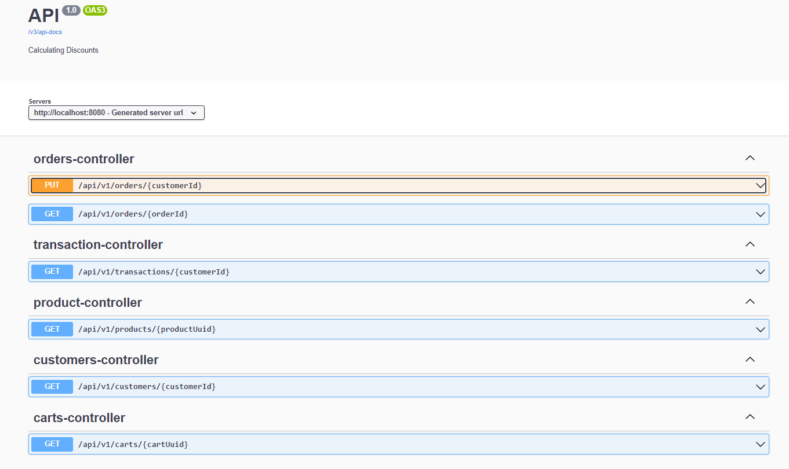
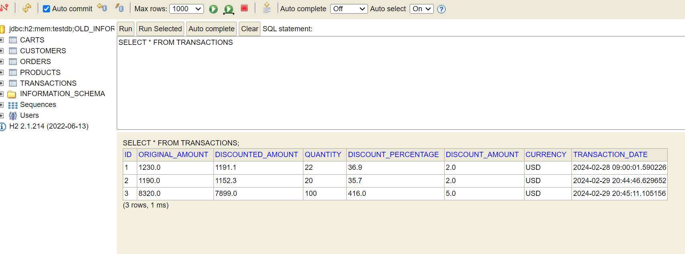
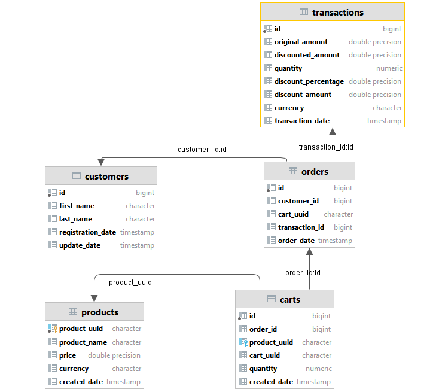
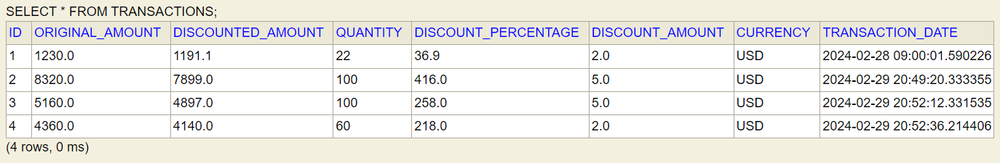
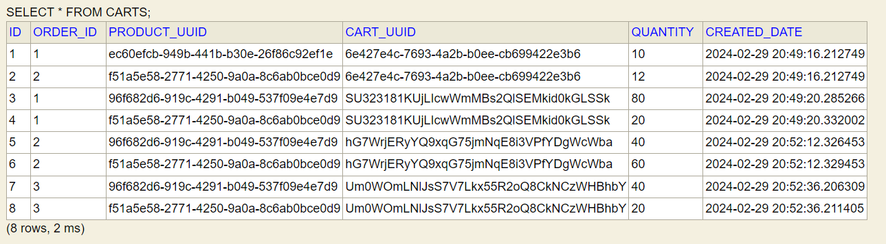
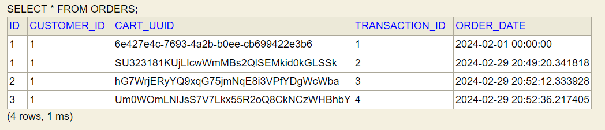
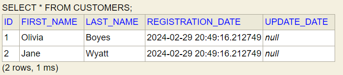
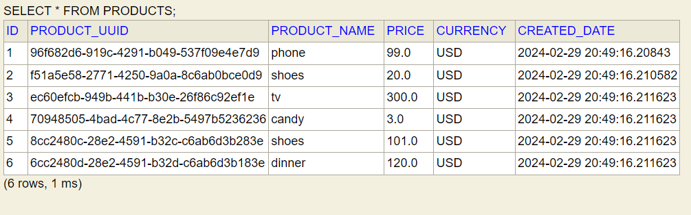
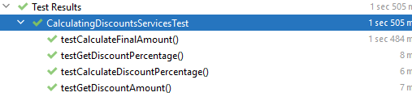

# Calculating Discounts # 

Version: **1.0  29.02.2024**

Author: **pgobi**

### About ###
Service that will provide a REST API for calculating a given product's price based on the number of products ordered.
There should be the possibility of applying discounts based on two policies:
- Amount-based 
- Percentage-based 

### Tech stack ####
- [java >= 17]
- [maven >= 2.7] 
- [Spring Boot = 2.7.9]
- [Junit5]
- [H2]

### Getting started  ####
Clone this repository from  Github to a directory of your choice
```
git clone 
```
Run the following command in the root directory of the backend:
```
mvn install
```
### How to build ####
```
mvn clean install
```

###  Discount Configuration ###
** properties :** [./src/main/resources/application.properties]()
#### [Policy Discount Amount]
```
# Example: [10 items ,100 items]
policyDiscountAmount.quantityOfProducts=10,100
# Example: [2 USD ,5 USD]
policyDiscountAmount.valueOfAmmount=2,5
```
#### [Policy Discount Percentage ]
```
# Example: [10 items ,50 items]
policyDiscountPercentage.quantityOfProducts=10,50
# Example: [3% ,5%]
policyDiscountPercentage.valueOfPercentage=3,5
```

## API ##
[Swagger UI]  [http://localhost:8080/swagger-ui/index.html]()




### [orders-controller]
**PUT**:  [http://localhost:8080/api/v1/orders/1]()

```
Request body:
{
    "cart": [
        {
            "productUuid": "96f682d6-919c-4291-b049-537f09e4e7d9",
            "quantity": 10
        },
        {
            "productUuid": "f51a5e58-2771-4250-9a0a-8c6ab0bce0d9",
            "quantity": 12
        }
    ]
}

Response:
{
  "orderId": 1,
  "cartUuid": "iKPKTRPdHoXZg0p5MuuzSvO1H4PwxYWPkCIl"
}
 
```
**GET**:  [http://localhost:8080/api/v1/orders/1]()
```
Response:
{
  "id": 1,
  "cartUuid": "6e427e4c-7693-4a2b-b0ee-cb699422e3b6",
  "customerId": 1,
  "transactionId": 1,
  "orderDate": "2024-02-01T00:00:00"
}
```

### [transaction-controller]
**GET**:  [http://localhost:8080/api/v1/transactions/1]()
```
Response:
{
  "id": 1,
  "amount": 120,
  "currency": "USD",
  "transactionDate": "2024-02-01T00:00:00",
  "rewardsPoints": 90
}
```

### [customers-controller]
**GET**:  [http://localhost:8080/api/v1/customers/1]()
```
Response:
{
  "id": 1,
  "cartUuid": "6e427e4c-7693-4a2b-b0ee-cb699422e3b6",
  "customerId": 1,
  "transactionId": 1,
  "orderDate": "2024-02-01T00:00:00"
}

```

### [customers-controller]
**GET**:  [http://localhost:8080/api/v1/products/ec60efcb-949b-441b-b30e-26f86c92ef1e]()
```
Response:
{
  "id": 3,
  "productName": "tv",
  "createdDate": "2024-02-28T20:23:02.847607",
  "price": 300,
  "currency": "USD",
  "productUuid": "ec60efcb-949b-441b-b30e-26f86c92ef1e"
}
```

### [carts-controller]
**GET**:  [http://localhost:8080/api/v1/carts/OlXVc1h4lEm7BdicFzKcJp19Ij6ui5zFGPSj]()

```
Response:
[
  {
    "id": 3,
    "productUuid": "96f682d6-919c-4291-b049-537f09e4e7d9",
    "quantity": 10,
    "cartUuid": "OlXVc1h4lEm7BdicFzKcJp19Ij6ui5zFGPSj",
    "orderId": 1,
    "createdDate": "2024-02-28T19:21:01.749156"
  },
  {
    "id": 4,
    "productUuid": "f51a5e58-2771-4250-9a0a-8c6ab0bce0d9",
    "quantity": 10,
    "cartUuid": "OlXVc1h4lEm7BdicFzKcJp19Ij6ui5zFGPSj",
    "orderId": 1,
    "createdDate": "2024-02-28T19:21:01.784239"
  }
]
```
## Database ###
[http://localhost:8080/h2-console]()

**URL:** [jdbc:h2:mem:testdb;OLD_INFORMATION_SCHEMA=TRUE;DATABASE_TO_UPPER=false;]()

**User**:sa

**pass**:sa



| Tabele | Description |
|------------|-----------|
| carts | list carts | 
| customers | list customers | 
| orders | list customers | 
| products | list products |
| transactions | list transactions | 



### SQL  ### 

**Init Databse SQL Query script:** [./src/main/resources/db/script.sql]()


**TRANSACTIONS**


**CARTS**


**ORDERS**


**CUSTOMERS**


**PRODUCTS**


**SQL Query Example :**  Summary discounted amount via customer_id
```
SELECT o."customer_id" , SUM (t."discounted_amount") As totalAmount
FROM "transactions" As t INNER JOIN "orders" AS o ON o."transaction_id"=t."id"
GROUP BY o."customer_id"
```

## Unit test ##
**URL**:  [./src/test/java/com/pgobi/calculatingdiscounts/services]()

**URL**:  [./src/test/java/com/pgobi/calculatingdiscounts/controller]()

Business logic test:


## Integration test ##
**URL**:  [./src/test/java/com/pgobi/calculatingdiscounts/integrationtest]()
